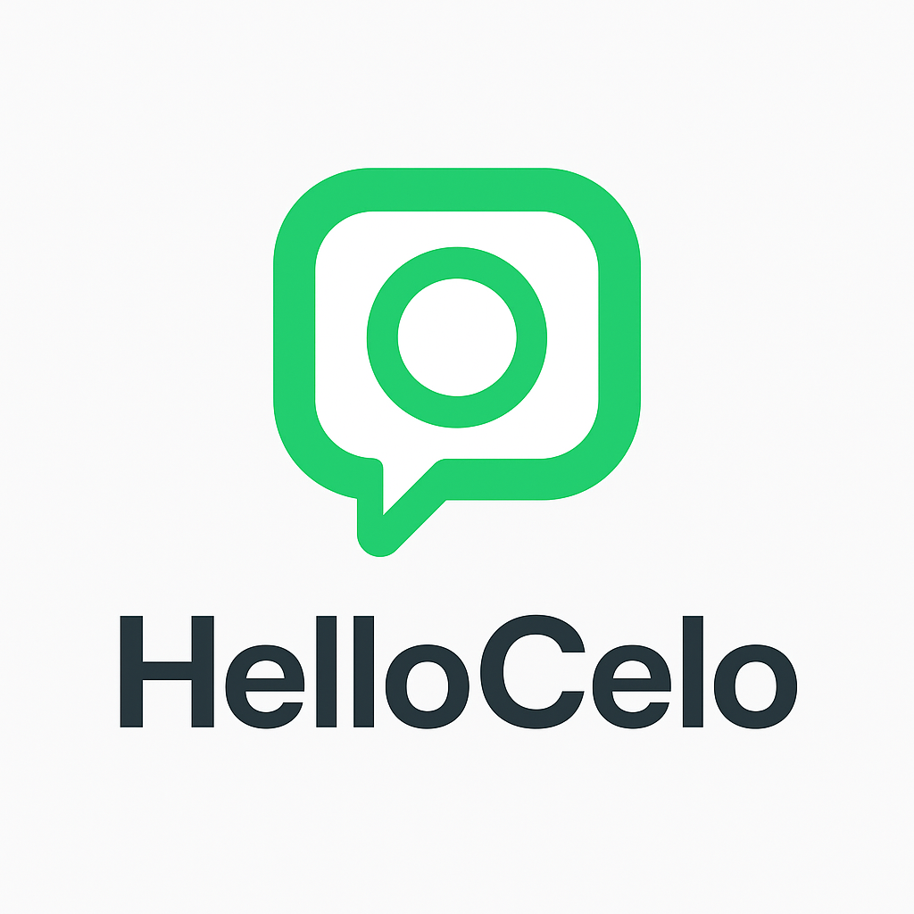

  
  <h1>HelloCelo DApp</h1>
  

    A decentralized on-chain message board built on the <strong>Celo blockchain</strong>. 
    Now integrated with <strong>KarmaGap</strong> for reward tracking and contribution verification.
  

---

## ✨ Features
- 📨 Send and store messages directly on-chain  
- 👀 View all messages in real time  
- ⚡ Event-driven updates for instant feedback  
- 🎯 KarmaGap integration — track and verify user contributions

---

## 🚀 Live Demo
🔗 [Try HelloCelo DApp](https://hello-celo-v2.vercel.app/)  
*(Runs directly in your browser — connect with MetaMask, Celo Wallet, or Rabby.)*

---

## 💰 Earn & Collect $HC Tokens

  

    <strong>Engage. Write. Earn.</strong> 
    Every on-chain message you post in the <b>HelloCelo DApp</b> helps build transparent Web3 communication — 
    and now it can also earn you <strong>$HC (HelloCelo)</strong> tokens.
  

### 🪙 How to Get $HC Tokens
1. **Connect your wallet** (MetaMask, Celo Wallet, or Rabby)  
2. **Send your first message** directly on-chain  
3. **Earn activity points** — tracked via <a href="https://gap.karmahq.xyz/project/hellocelo" target="_blank" rel="noopener noreferrer">KarmaGap</a>  
4. **Claim $HC rewards** for verified participation and contribution to the community  

---

### 💎 What is $HC?
$HC (HelloCelo Token) is a **community-driven reward token** on **Celo Mainnet** — created to encourage:
- meaningful on-chain interaction 🗣️  
- positive social engagement 🌱  
- community-led growth on Celo ⚙️  

Join the movement.  
Start messaging — and earn your first $HC tokens today! 🚀  

🔗 <a href="https://hello-celo-v2.vercel.app/" target="_blank" rel="noopener noreferrer">Try the HelloCelo DApp</a>

## 🧾 Smart Contract
**File:** `contracts/HelloCelo.sol`  
**Deployed on:** Celo Mainnet  
**Address:** [`0x88Fd392bC4d948DaD1d27B73cad89fF34507EA9B`](https://celo.blockscout.com/address/0x88Fd392bC4d948DaD1d27B73cad89fF34507EA9B?tab=contract)

---

## 🔗 Links & Resources
- 🌐 [KarmaGap Project Page](https://gap.karmahq.xyz/project/hellocelo)  
- 📚 [Celo Documentation](https://docs.celo.org/)  
- 🧠 [Proof of Ship](https://github.com/celo-org/Proof-of-Ship)
- 🐦 [HelloCelo on X (Twitter)](https://x.com/HelloCelo_HC)

---

## 🤝 Contributing
Want to improve HelloCelo?  
Fork the repository, create a branch, and submit a pull request — all contributions are welcome!

---

⭐ **Built by [Mystique85](https://github.com/Mystique85)**  
on top of the **Celo** blockchain with ❤️
